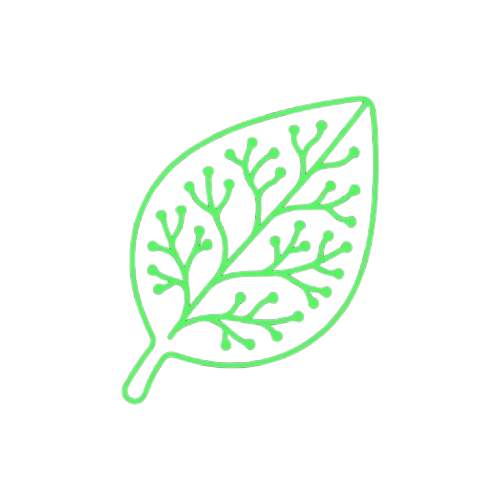

<div align="center">



# Synapse

**Focus & Grow**

A calm focus companion. Run deep-work sessions, grow your streak, and study smarter with built-in learning tools.

[](https://nextjs.org)
[](https://react.dev)
[](https://www.typescriptlang.org)
[](https://tailwindcss.com)
[](https://pnpm.io)
[](https://vercel.com)

</div>

## Features

| | Tool | What it does |
| --- | --- | --- |
| ⏱ | **Focus Timer** | 25-minute deep-work and 5-minute break sessions with a Pomodoro-style cycle. |
| 🌱 | **Growth Visual** | A plant rises, unfurls leaves, and blooms as your session progresses, set against an ambient breathing glow and drifting spores. |
| 🔥 | **Streak Bar** | Last-14-day activity at a glance to keep the momentum going. |
| 🌧 | **Ambient Rain** | An optional rain toggle for a calmer background. |
| 🧠 | **Learning Tools** | Feynman Mode, ELI5, Flashcards, Study Chat, Planner, and Squad — a growing suite of study companions. |

> The learning tools are currently placeholders and marked *Coming soon*.

## Getting Started

**Requirements:** Node.js `>= 20` and [pnpm](https://pnpm.io) (version pinned in `package.json`).

```bash
# 1. Install dependencies
pnpm install

# 2. Start the development server
pnpm dev
```

Open [http://localhost:3000](http://localhost:3000) with your browser.

### Available Scripts

| Command | Description |
| --- | --- |
| `pnpm dev` | Starts the dev server with hot reload. |
| `pnpm build` | Creates a production build. |
| `pnpm start` | Serves the production build. |

## Project Structure

```
.
├── app/                  # App Router pages & root layout
│   ├── layout.tsx        # metadata, favicon/logo, fonts, theme
│   ├── page.tsx          # entry point → <SynapseApp />
│   └── globals.css       # dark forest theme + animation keyframes
├── components/
│   ├── ui/               # base UI primitives
│   └── synapse/          # timer, growth visual, streaks, navigation, tools
├── hooks/                # focus-timer & ambient-rain state
├── lib/                  # shared helpers
└── public/               # static assets (favicon, logo)
```

## Tech Stack

| Layer | Technology |
| --- | --- |
| Framework | Next.js 16 (App Router) |
| UI | React 19, Tailwind CSS 4, shadcn/ui |
| Language | TypeScript |
| Package manager | pnpm 12 |
| Hosting | Vercel |

## Deployment

This project deploys on [Vercel](https://vercel.com). Vercel installs dependencies with a frozen `pnpm install`, so keep `pnpm-lock.yaml` in sync after changing dependencies:

```bash
pnpm install --lockfile-only
```

---

<p align="center">
  <sub>Built for calm, focused work. All rights reserved.</sub>
</p>